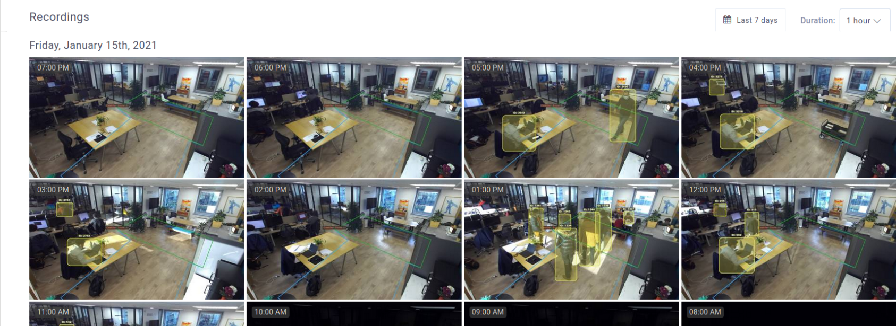

# Tutorial 2 - Live Stream and Continuous Recording

This tutorial shows how to deploy an application that starts a ZED camera and sends the live stream to the ZED Hub interface. You will also be able to store the video on your device. The recorded video will be available on the ZED Hub interface and downloadable.

[**Github repository**](https://github.com/stereolabs/zed-hub-examples/tree/main/tutorials/tutorial_02_live_stream_and_recording)

## Requirements
You will deploy this tutorial on one of the devices installed on your ZED Hub workspace. The ZED Hub supports Jetson Nano, TX2 and Xavier or any computer. If you are using a Jetson, make sure it has been flashed. If you haven't done it already, [flash your Jetson](https://docs.nvidia.com/sdk-manager/install-with-sdkm-jetson/index.html).

To be able to run this tutorial:
- [Sign In the ZED Hub and create a workspace](https://www.stereolabs.com/docs/cloud/overview/get-started/).
- [Add and Setup a device](https://www.stereolabs.com/docs/cloud/overview/get-started/#add-a-camera).
- A ZED must be plugged to this device.
- **Enable recordings** and **disable privacy mode** in the Settings panel of your device

This tutorial needs Edge Agent. By default when your device is setup, Edge Agent is running on your device.

You can start it using this command, and stop it with CTRL+C (note that it's already running by default after Edge Agent installation) :
```
$ edge_cli start
```

If you want to run it in background use :
```
$ edge_cli start -b
```

And to stop it :
```
$ edge_cli stop
```

## Build and run this tutorial for development

Run the Edge Agent installed on your device using (note that it's already running by default after Edge Agent installation) :
```
$ edge_cli start
```

Then to build your app :
```
$ mkdir build
$ cd build
$ cmake ..
$ make -j$(nproc)
```

Then to run your app :
```
./ZED_Hub_Tutorial_2
```

## What you should see after deployment
This app have two direct consequences in the ZED Hub interface:
- A live stream should be visible
- The available recording should be listed

### Live video
In the **Settings** panel of your device, make sure that the **Privacy mode** is disabled, otherwise the video won't be visible.

If you click in the **Devices** panel on the device where the app is deployed, you should see the live video (with a delay of a few seconds).


### Recordings

In the **Settings** panel of your device, make sure that the **Enable Recording** parameter is set to True, otherwise the video won't be recorded. Keep **Recording Mode** on **Continuous**. It means that everything will be recorded. The only limit is your device Hard Drive storage. When there is no space left on it, the older recordings are **erased**.

It is the only thing to do to start recording. The recordings are listed by hour and day in the **Video** panel of your device.




## The Source Code explained

This sample app starts a ZED and retrieves every frame. Then, the application gets the camera position and sends it to the cloud at each frame. Therefore the Telemetry panel will contain all the consecutive position of your camera.

What exactly happens:

- Init IOT to enable communications with the cloud. Note that compared to tutorial 1 where no ZED was required, here the cloud is init with a ZED pointer p_zed.

```cpp
    // Initialize the communication to ZED Hub, with a zed camera.
    std::shared_ptr<sl::Camera> p_zed;
    p_zed.reset(new sl::Camera());

    STATUS_CODE status_iot;
    status_iot = HubClient::connect("streaming_app");
    if (status_iot != STATUS_CODE::SUCCESS) {
        std::cout << "Initialization error " << status_iot << std::endl;
        exit(EXIT_FAILURE);
    }    
```


- Open the ZED with `p_zed->open(initParameters)`. [ZED Documentation](https://www.stereolabs.com/docs/video/camera-controls/#camera-configuration)

```cpp
    //Open the ZED camera
    sl::InitParameters initParameters;
    initParameters.camera_resolution = RESOLUTION::HD2K;
    initParameters.depth_mode = DEPTH_MODE::NONE;

    sl::ERROR_CODE status_zed = p_zed->open(initParameters);

    // Register the camera once it has been open
    UpdateParameters updateParameters;
    status_iot = HubClient::registerCamera(p_zed, updateParameters);
    if (status_iot != STATUS_CODE::SUCCESS) {
        std::cout << "Camera registration error " << status_iot << std::endl;
        exit(EXIT_FAILURE);
    }
```


- In a While loop, grab a new frame and call `HubClient::update()`. Note that the `update` is responsible for both **live stream** and **recording**. The sent image corresponds of course to the grabbed image, so to current frame.


```cpp
    // Main loop
    while (true) {
        // Grab a new frame from the ZED
        status_zed = p_zed->grab();
        if (status_zed != ERROR_CODE::SUCCESS) break;

        // Insert custom code here

        // Always update Hub at the end of the grab loop
        HubClient::update();
    }
```

## Custom stream

The ZED Hub supports custom streams, meaning you can send as live video the video of your choice. To do that, just add the `sl::Mat` you built as an argument of `update()`.
