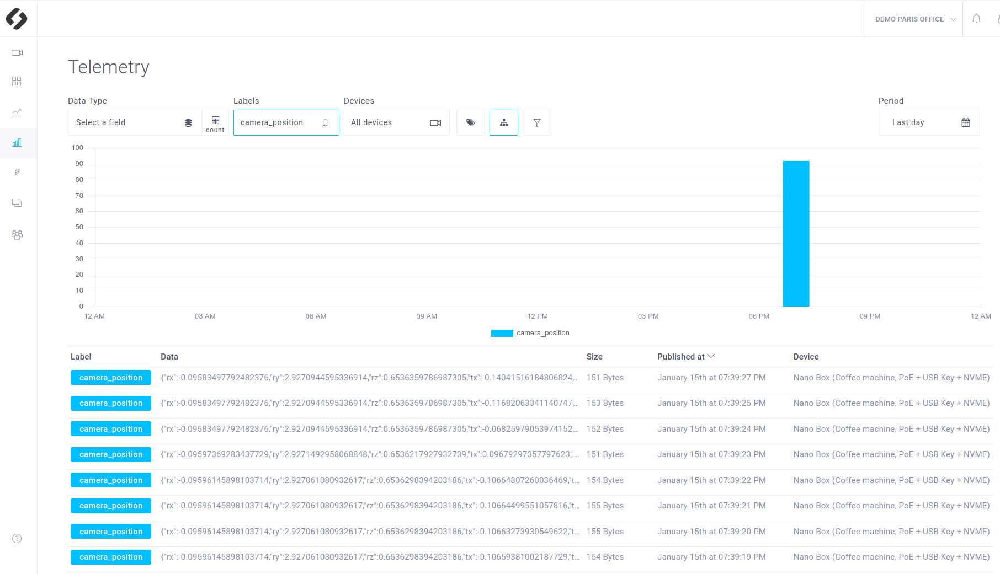

# Tutorial 3 - Telemetries
> **NOTE**: The source code of this application and a code explaination are available [here](https://github.com/stereolabs/cmp-examples/tree/main/tutorials)

This tutorial shows you how to send telemetry to the cloud. This sample app opens a ZED and enable ZED tracking, meaning that you can access the camera position at each frame. Then the application gets the camera position and sends it to the cloud at each frame. Therefore the Telemetry panel will contain all the concecutive position of your camera.  

## What you will obtain after deployment
This app have two direct consequences in the CMP interface:
- A live stream should be visible
- The published telemetry should be accessible

### Live video
Wait at least until your app is **running**. 
If you click in the **Devices** panel  on the device where the app is deployed, you should see the live video (with a delay of a few seconds).

###  Telemetry
If you click go in the **Telemetry** panel, you should see the telemetry of your camera position as follow:

## Deployment

### Requirements
You will deploy this tutorial on one of the devices installed on your CMP workspace. The CMP supports Jetson Nano, TX2 and Xavier or any computer. If you are using a Jetson, make sure it has been flashed. If you haven't done it already, [flash your Jetson](https://docs.nvidia.com/sdk-manager/install-with-sdkm-jetson/index.html).

To be able to run this tutorial:
- [Sign In the CMP and created a workspace](https://www.stereolabs.com/docs/cloud/overview/get-started/).
- [Add and Setup a device](https://www.stereolabs.com/docs/cloud/overview/get-started/#add-a-camera).
- A ZED must be plugged to this device.
- **Enable recordings** and **disable privacy mode** in the Settings panel of your device

### How to deploy your application
You just need to [deploy your app](https://www.stereolabs.com/docs/cloud/applications/sample/#deploy) using the CMP interface:

- Select the devices on which you want to deploy the app 
- Click on the **Deploy** button
