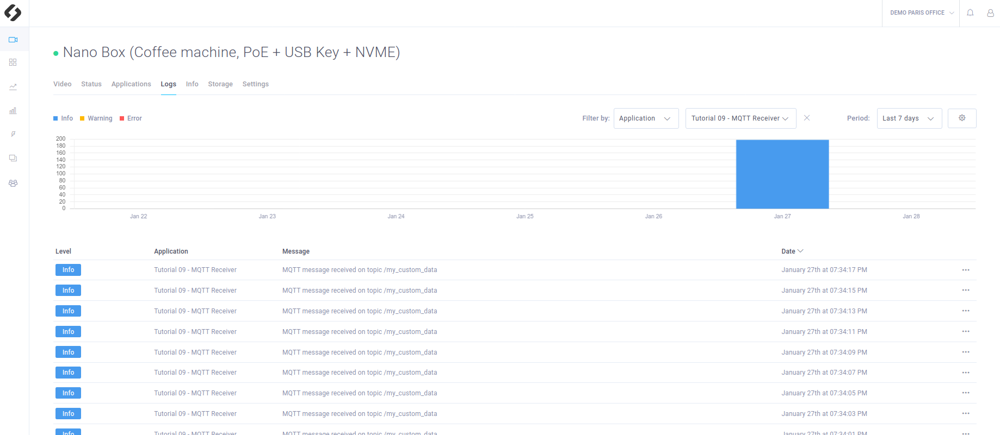

# Tutorial 9 - MQTT Subscriber

> **NOTE**: This tutorial should be runned with the tutorial 8 : **MQTT Subscriber**

This tutorial shows you how to communicate between apps on the local network. It subscribes to a MQTT topics and send a log to notify that the messages have been received.


## Requirements
You will deploy this tutorial on one of the devices installed on your CMP workspace. The CMP supports Jetson Nano, TX2 and Xavier or any computer. If you are using a Jetson, make sure it has been flashed. If you haven't done it already, [flash your Jetson](https://docs.nvidia.com/sdk-manager/install-with-sdkm-jetson/index.html).

To be able to run this tutorial:

- [Sign In the CMP and created a workspace](https://www.stereolabs.com/docs/cloud/overview/get-started/).
- [Add and Setup a device](https://www.stereolabs.com/docs/cloud/overview/get-started/#add-a-camera).


## Build and deploy this tutorial

### How to build your application
To build your app just run:

```
$ cd /PATH/TO/tutorial_09_mqtt_subscriber
$ ./cmp_builder.sh
```

- The script will ask for the **device type** (jetson or classic x86 computer) on which you want to deploy this app. **Note** that it may be different than the computer on which you run `cmp_builder.sh`.
- The script will also ask for your **device cuda version**. If you do not know it you can find it in the **Info** section of your device in the CMP interface.
- Finally you will be asked the **IOT version** you want to use. It corresponds to the base docker imaged used to build your app docker image. You can chose the default one, or look for the [most recent version available on Dockerhub](https://hub.docker.com/r/stereolabs/iot/tags?page=1&ordering=last_updated).

### How to deploy your application
`cmp_builder.sh` packages your app by generating a app.zip file. 
Now you just need to [deploy your app](https://www.stereolabs.com/docs/cloud/applications/sample/#deploy) using the CMP interface:

- In your workspace, in the **Applications** section, click on **Create a new app** 
- Get the .zip an Drag’n’Drop in the dedicated area
- Select the devices on which you want to deploy  the app and press **Deploy** 

**Additional information about deployment and CMP apps :**

This README only focus on the source code explaination and the way to deploy the app without giving technical explaination about the app deployment. 
Please refer to the main README of this repository if you want more information about the CMP apps structure and technical precisions.  


## What you should see after deployment

The app subscribe to the MQTT topic where the tutorial 8 (MQTT publisher) publishes: `/v1/local_network/my_custom_data`. A log is published each time a message is received. 




## Code overview
The app must be **init** to be connected to the local Brocker.
The app subscribe the topic `/v1/local_network/my_custom_data` composed of the topic prefix `/v1/local_network` and the topic name `my_custom_data`.
When a message is received the callback `onDataReceived` is triggered.

```c++
//Init sl_iot
STATUS_CODE sc = IoTCloud::init(val, p_zed);
if (sc != STATUS_CODE::SUCCESS) {
    IoTCloud::log("Failed to Init Cloud", LOG_LEVEL::ERROR);
    exit(EXIT_FAILURE);
}


// Topic to be listen
TARGET topic_prefix = TARGET::LOCAL_NETWORK;
std::string topic_name = "/my_custom_data";

//
IoTCloud::subscribeToMqttTopic(topic_name, onDataReceived, topic_prefix);
```

`onDataReceived` is defined as follow. Each time a mesasge is received, a log is sent and the message is also displayed in the runtime terminal.

```c++
void onDataReceived(std::string topic, std::string message, TARGET target, void* arg)
{
    std::cout << "Message received !" << std::endl;
    json my_raw_data = json::parse(message);
    std::cout << "My received message : " << my_raw_data << std::endl;
    IoTCloud::log("MQTT message received on topic " + topic,LOG_LEVEL::INFO); 
}
```